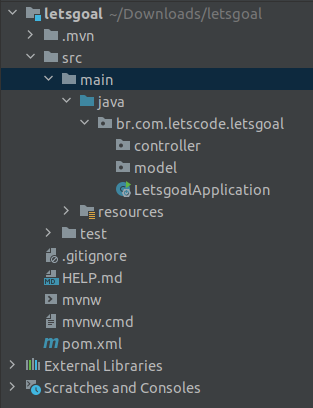

## Aula Prática 01

#### Criando Spring MVC

1. Na sua IDE escolhida clique para criar um novo projeto utilizando o Maven.

2. Inserir os seguintes valores para criação:

**Name:** `alunos`
**Archetype:** `org.apache.maven.archetypes:maven-archetype-webapp`
**GroupId:** `br.com.letscode`

3. Após o download das dependências o projeto será criado com a estrutura de uma aplicação web, após o término da criação da estrutura será necessário clicar com o botão direito em cima do diretório `src\main` e criar a pasta `java`

4. No arquivo `pom.xml` entre as tags `<dependency>`, deverá ser adicionado o conteúdo abaixo:

```xml
<dependency>
    <groupId>org.springframework</groupId>
    <artifactId>spring-webmvc</artifactId>
    <version>5.1.0.RELEASE</version>
</dependency>
<dependency>
    <groupId>javax.servlet.jsp.jstl</groupId>
    <artifactId>javax.servlet.jsp.jstl-api</artifactId>
    <version>1.2.1</version>
</dependency>
<dependency>
    <groupId>taglibs</groupId>
    <artifactId>standard</artifactId>
    <version>1.1.2</version>
</dependency>
<dependency>
    <groupId>javax.servlet</groupId>
    <artifactId>javax.servlet-api</artifactId>
    <version>3.1.0</version>
    <scope>provided</scope>
</dependency>
<dependency>
    <groupId>javax.servlet.jsp</groupId>
    <artifactId>javax.servlet.jsp-api</artifactId>
    <version>2.3.1</version>
    <scope>provided</scope>
</dependency>
 <dependency>
    <groupId>com.fasterxml.jackson.core</groupId>
    <artifactId>jackson-databind</artifactId>
    <version>2.10.0.pr3</version>
</dependency>
```

5. No arquivo `pom.xml` entre as tags `<plugins>`, deverá ser adicionado o conteúdo:

```xml
<plugin>
    <artifactId>maven-compiler-plugin</artifactId>
    <version>3.5.1</version>
    <configuration>
        <source>1.8</source>
        <target>1.8</target>
    </configuration>
</plugin>
```
6. Criar uma estrutura de pacote chamado `br.com.letscode.config` e uma classe chamada `AppConfig.java` com o seguinte conteúdo:
```java
@Configuration
@EnableWebMvc
@ComponentScan
public class AppConfig {

    @Bean
    public InternalResourceViewResolver resolver() {
        InternalResourceViewResolver resolver = new InternalResourceViewResolver();
        resolver.setViewClass(JstlView.class);
        resolver.setPrefix("/WEB-INF/views/");
        resolver.setSuffix(".jsp");
        return resolver;
    }
}
```

7. Dentro do pacote `br.com.letscode.config` crie uma classe chamada `SpringMvcDispatcherServletInitializer.java` com o seguinte conteúdo:

```java

public class SpringMvcDispatcherServletInitializer extends AbstractAnnotationConfigDispatcherServletInitializer {

    @Override
    protected Class<?>[] getRootConfigClasses() {
        return null;
    }

    @Override
    protected Class<?>[] getServletConfigClasses() {
        return new Class[]{
                AppConfig.class
        };
    }

    @Override
    protected String[] getServletMappings() {
        return new String[]{
                "/"
        };
    }
}
```

8. Crie um pacote chamado `model` dentro da estrutura `br.com.letscode.alunos` e crie um arquivo chamado `Aluno.java` com o seguinte conteúdo:

```java
public class Aluno {
    private String nome;
    private Integer idade;
    private String turma;

    public String getNome() {
        return nome;
    }

    public void setNome(String nome) {
        this.nome = nome;
    }

    public Integer getIdade() {
        return idade;
    }

    public void setIdade(Integer idade) {
        this.idade = idade;
    }

    public String getTurma() {
        return turma;
    }

    public void setTurma(String turma) {
        this.turma = turma;
    }
}
```

9. Crie um pacote chamado `controller` dentro da estrutura `br.com.letscode.alunos` e crie um arquivo chamado `AlunoController.java` com o seguinte conteúdo:

```java
@Controller
public class AlunoController {

    @RequestMapping("/alunos")
    public String handler(Model model) {
        Aluno aluno = new Aluno();
        aluno.setIdade(25);
        aluno.setNome("Hugo Brendow");
        aluno.setTurma("CI&T");
        model.addAttribute("aluno", aluno);
        return "alunos";
    }
}
```

10. Dentro da estrutura `webapp`, crie uma pasta dentro de `WEB-INF` chamada `views` e dentro desta pasta crie o arquivo chamado `alunos.jsp` com o seguinte conteúdo:

```java
<%@ page language="java" contentType="text/html; charset=ISO-8859-1"
         pageEncoding="ISO-8859-1"%>
<%@ taglib uri="http://java.sun.com/jsp/jstl/core" prefix="c"%>
<!DOCTYPE html>
<html>
<head><%@ page isELIgnored="false" %>
    <meta charset="ISO-8859-1">
    <title>Alunos | Lista</title>
</head>
<body>
<h2>${aluno.nome}</h2>
<h4>Este aluno está no módulo ${aluno.turma} e tem ${aluno.idade} anos de idade</h4>
</body>
</html>
```

11. Execute o comando abaixo:

```sh
mvn clean install
```

12.  Após a execução verifique onde foi gerado o conteúdo `.war` da aplicação no log do comando acima, e execute o comando abaixo alterando a palavra `DIRETORIO` para o que foi encontrado no log acima.

```sh
docker run -v DIRETORIO/alunos-1.0-SNAPSHOT.war:/usr/local/tomcat/webapps/letscode.war -it -p 8080:8080 tomcat:8.5
```

O comando acima utiliza uma imagem do tomcat para rodar o projeto.

13. Verifique o resultado no browser no endereço: `http://localhost:8080/letscode/alunos`

14. Para exibir o resultado em um objeto JSON podemos criar uma classe dentro do diretório `controller` com o nome `AlunoRestController` com o conteúdo:

```java
@RestController
@RequestMapping("listagem")
public class AlunoRestController {

    @GetMapping("alunos")
    public Aluno getAluno() {
        Aluno aluno = new Aluno();
        aluno.setNome("Hugo Brendow");
        aluno.setIdade(25);
        aluno.setTurma("CI&T");
        return aluno;
    }
}
```

15. Realizar o mesmo procedimento dos tópicos `11 e 12` e acessar via browser o endereço `http://localhost:8080/letscode/listagem/alunos`


#### Estrutura do projeto:

