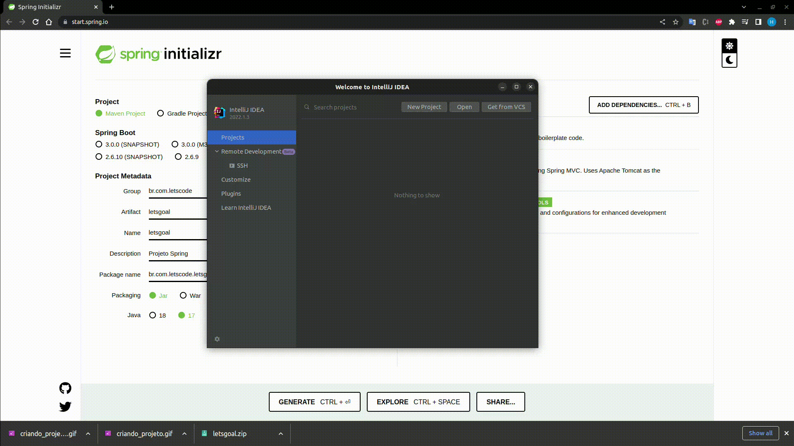
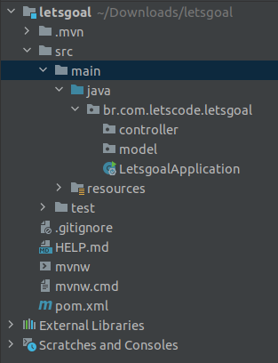

## Criando projeto com Spring Boot

1. Acesso o site: [Spring Initializr](http://start.spring.io)


Neste passo adicionamos as dependências e criamos nosso projeto inicial com ajuda do Spring Initializr.

As dependências utilizadas:
- Lombok
- Web
- DevTools

2. Descompatar o arquivo zip que foi realizado o download

3. Adicione o projeto na IDE de sua escolha:

Nesta etapa após ter descompactado importamos nosso projeto na IDE que iremos utilizar.



4. Após a importação e o download das dependências, é necessário a criação de 2 pacotes que iremos trabalhar neste momento. São eles:

- controller
- model



5. Criaremos nossa primeira classe para representar os patrocinadores do Let's Clube, no pacote: `model`.

```java
package br.com.letscode.letsgoal.model;

import lombok.Data;

@Data
public class Patrocinador {
    private Long id;
    private String descricao;
    private String urlLink;
    private String imagemMarca;
    private String nome;
}
```

Nesta classe foi utilizado a anotation `@Data` do Lombok que possui a implementação dos Getters e Setters e construtores default para a classe.

6. Criaremos nossa primeira classe que irá representar os endpoints com retornos estáticos, no primeiro momento.

[Boas Práticas REST](https://www.brunobrito.net.br/api-restful-boas-praticas/#:~:text=Os%20princ%C3%ADpios%20do%20REST%20envolvem,DELETE%20tem%20um%20significado%20espec%C3%ADfico.&text=Idempotente%20significa%20que%20o%20endpoint,v%C3%A1rias%20vezes%20sem%20resultados%20diferentes.)

```java
@RestController
@RequestMapping("/patrocinadores")
public class PatrocinadorController {

    @GetMapping
    public List<Patrocinador> listar() {
        Patrocinador patrocinador = new Patrocinador();
        patrocinador.setDescricao("Let's Code");
        patrocinador.setId(1l);
        patrocinador.setImagemMarca("https://letscode.com.br/images/LetsCodePass/LetsCodePassLogo.svg");
        patrocinador.setUrlLink("https://letscode.com.br");
        List<Patrocinador> lista = List.of(patrocinador);
        return lista;
    }
}
```

Código atualizado no repositório: [PROJETO](https://github.com/hugobrendow/letsgoal)
