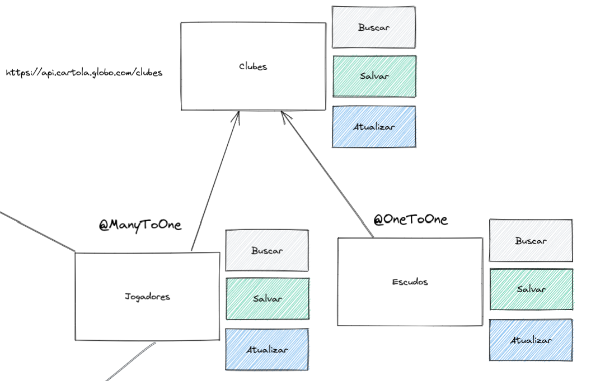

## Relacionamentos de Entidades

Criando estrutura:



1. Criar a classe `Escudo.java` no pacote `model`:

```java
@Data
@Entity
public class Escudo {
    @Id
    @GeneratedValue(strategy = GenerationType.IDENTITY)
    private Long id;
    private String tamanho60x60;
    private String tamanho45x45;
    private String tamanho30x30;
}
```

2. Criar a classe `Jogador.java` no pacote `model`:

```java
@Data
@Entity
public class Jogador {
    @Id
    @GeneratedValue(strategy = GenerationType.IDENTITY)
    private Long id;
    private BigDecimal preco;
    private String nome;
    private String apelido;
    private String foto;
    private Long media;
    private Long totalJogos;
    private Long status;

    /*
        Nesta relação estamos tratando:
            1 Clube pode ter 0 ou N jogadores
            e 1 Jogador pode ter apenas 1 Clube

        optional = false
            Significa que é obrigatório o jogador ter um clube

        nullable = false
            Significa que o clube não pode ser um valor null
     */
    @ManyToOne(fetch = FetchType.LAZY, optional = false)
    @JoinColumn(name = "clube_id", nullable = false)
    private Clube clube;
}
```

3. Criar a classe `Clube.java` no pacote `model`:

```java
@Data
@Entity
public class Clube {
    @Id
    @GeneratedValue(strategy = GenerationType.IDENTITY)
    private Long id;
    private String nome;
    private String abreviacao;
    private String nomeFantasia;

    /*
        Nesta relação, 1 clube pode ter apenas 1 objeto de escudo. E escudo só pode ter um clube

        @JoinColumn
            name = Definimos o nome da coluna que cuidará da relação entre Clube x Escudo
            referencedColumnName = é o nome da coluna da chave do escudo que irá relacionar com o Clube

        RELAÇÃO UNIDIRECIONAL

        ###############################################
        PARA UMA RELAÇÃO BIDIRECIONAL:
            DEVE SER ADICIONADO NO OBJETO DO ESCUDO

            @OneToOne(mappedBy = "escudo")
            private Clube clube;
     */
    @OneToOne(cascade = CascadeType.ALL)
    @JoinColumn(name = "escudo_id", referencedColumnName = "id")
    private Escudo escudo;

    /*
        BIDIRECIONAL

        Nesta relação estamos tratando:
            1 Clube pode ter 0 ou N jogadores
            e 1 Jogador pode ter apenas 1 Clube

        mappedBy = se refere ao atributo da Classe Jogador onde está o relacionamento
        fetch = EAGER OU LAZY
            Por padrão o fetch é Lazy.

            Carregamento EAGER = este atributo faz com que no momento do carregamento do clube os jogadores já sejam carregados
            Carregamento LAZY = conhecido como carregamento preguiçoso, a informação só é carregada quando você precisa


        UNIDIRECIONAL

        orphanRemoval = true
            Significa que caso o Clube seja removido os jogadores podem ser removido também

        @OneToMany(cascade = CascadeType.ALL, fetch = FetchType.LAZY, orphanRemoval = true)
        @JoinColumn(name = "clube_id")
     */
    
    /* COMENTADO, POIS NÃO SERÁ NECESSÁRIO O USO
    @OneToMany(mappedBy = "clube", fetch = FetchType.LAZY, cascade = CascadeType.ALL)
    private List<Jogador> jogadores;*/
}
```

4. Criar uma interface de repositório com o nome `ClubeRepository.java` no diretório `repository`

```java
@Repository
public interface ClubeRepository extends JpaRepository<Clube, Long> {
    Optional<Clube> findByNomeOrAbreviacao(String nome, String abreviacao);
}
```

5. Criar uma classe de Serviço com o nome `ClubeService.java` no diretório `service`

```java
@Service
@AllArgsConstructor
public class ClubeService {
    private ClubeRepository clubeRepository;

    public Clube salvar(Clube clube) {
        // Não permitir clube duplicado
        clubeRepository.findByNomeOrAbreviacao(clube.getNome(), clube.getAbreviacao())
                .ifPresent(obj -> {
                    throw new ClubeExistenteException();
                });
        return clubeRepository.save(clube);
    }
}
```

6. Criar uma Exception no diretório `exception` com o nome `ClubeExistenteException.java`:

```java
public class ClubeExistenteException extends RuntimeException {
}
```

7. Criar uma Controller no diretório `controller` com o nome `ClubeController.java`:

```java
@RestController
@RequestMapping("/clubes")
@AllArgsConstructor
public class ClubeController {
    private ClubeService clubeService;

    @PostMapping
    public Clube salvar(@RequestBody @Valid ClubeDTO clubeDTO) {
        Clube clube = new Clube();
        Escudo escudo = new Escudo();
        BeanUtils.copyProperties(clubeDTO, clube);
        BeanUtils.copyProperties(clubeDTO.getEscudo(), escudo);
        clube.setEscudo(escudo);
        return clubeService.salvar(clube);
    }
}
```

## Consultas com JPA

Quando inserimos a assinatura abaixo:

```java
Optional<Clube> findByNomeOrAbreviacao(String nome, String abreviacao);
```

Significa que o JPA irá montar uma consulta buscando pelos atributos de Nome ou de Abreviação no objeto do Clube, passando por parâmetro os campos de buscas.